# Restaurantzz

**Restaurantzz** is a Prototype Flutter-based restaurant recommendation app. The app allows users to discover and explore recommended restaurants with an elegant and responsive UI. It supports both dark and light themes based on system preferences, and utilizes modern features such as Material 3 UI and Hero animations.

## 🛠️ Getting Started

For help getting started with Flutter development, view the
[online documentation](https://docs.flutter.dev/), which offers tutorials,
samples, guidance on mobile development, and a full API reference.

## 🌟 Features

- **Restaurant Recommendations:** View and search list of recommended restaurants.
- **Restaurant Details:** See detailed information about each restaurant.
- **Submit Review:** Write your own review.
- **Responsive UI:** Material 3 UI with adaptive design.
- **Dark and Light Themes:** The app automatically switches between dark and light themes based on the system settings.
- **Favorite List:** Save your favorite restaurant.
- **Schedule Notification**: Daily notification at 11 a.m. about random restaurant. (only for mobile)

## 📸 Screenshots

🌞 Light Mode

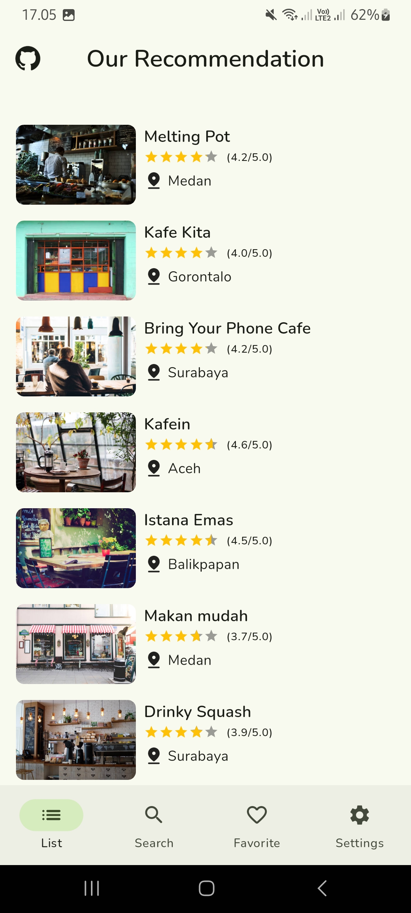&nbsp;
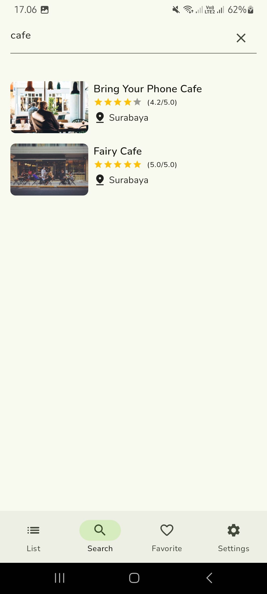&nbsp;
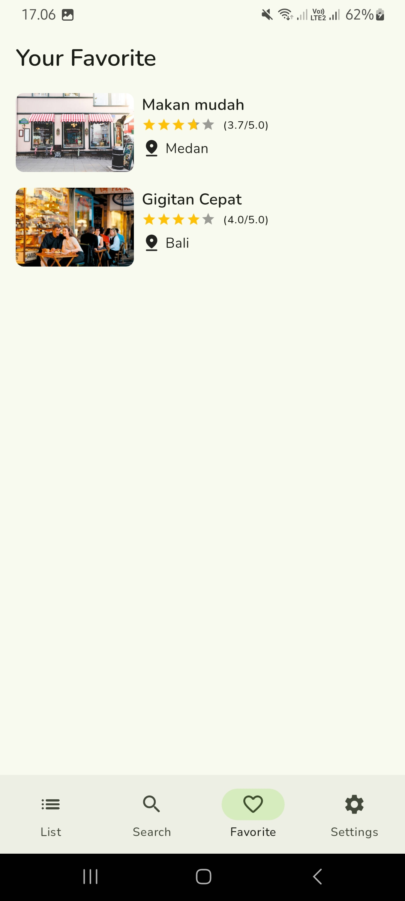&nbsp;
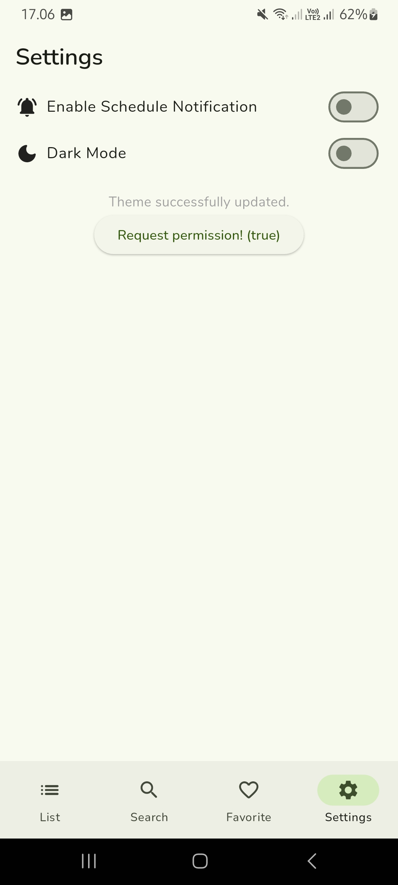&nbsp;
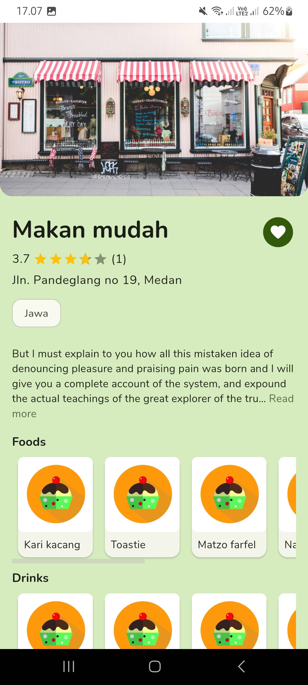&nbsp;
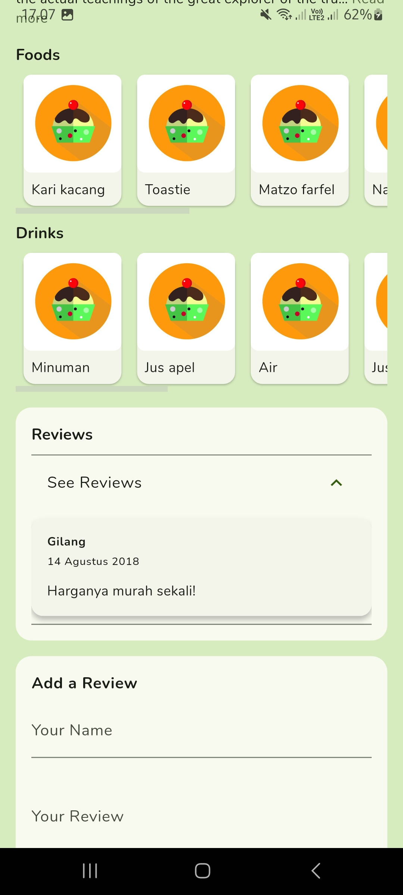&nbsp;
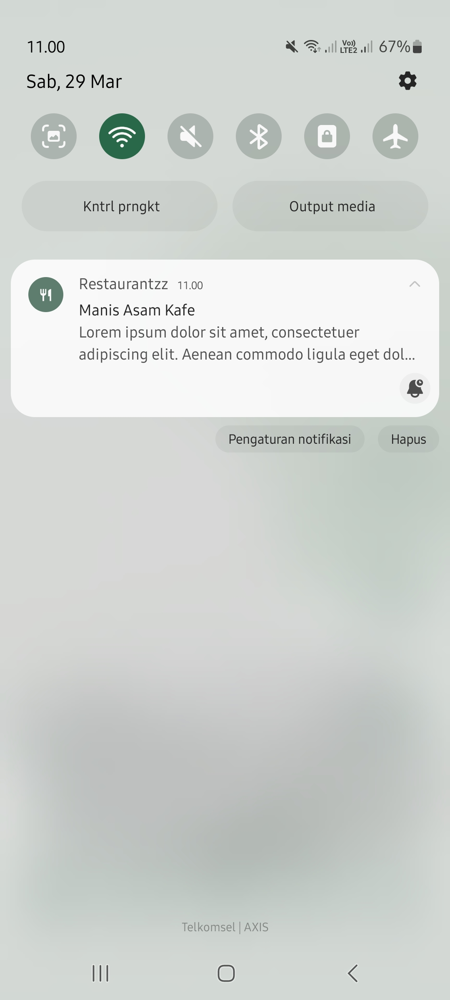&nbsp;

### 

🌙 Dark Mode

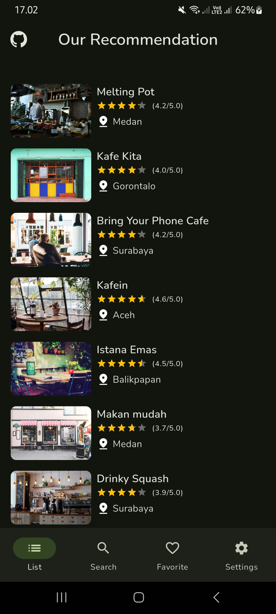&nbsp;
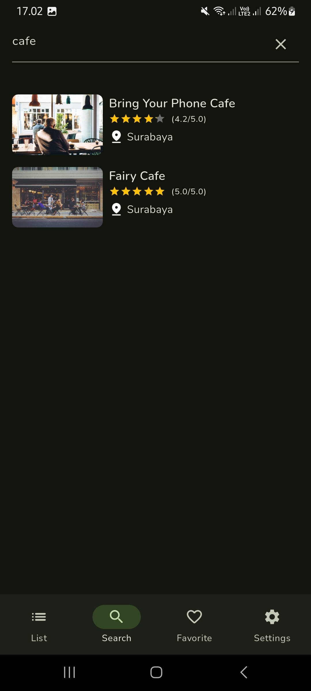&nbsp;
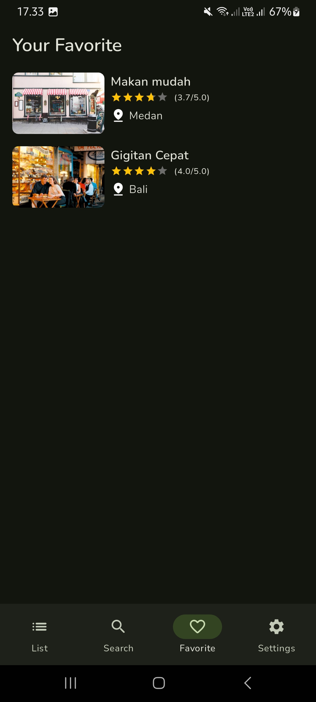&nbsp;
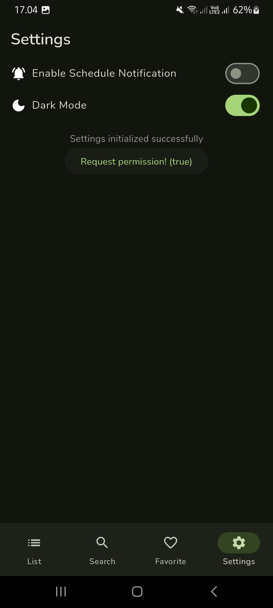&nbsp;
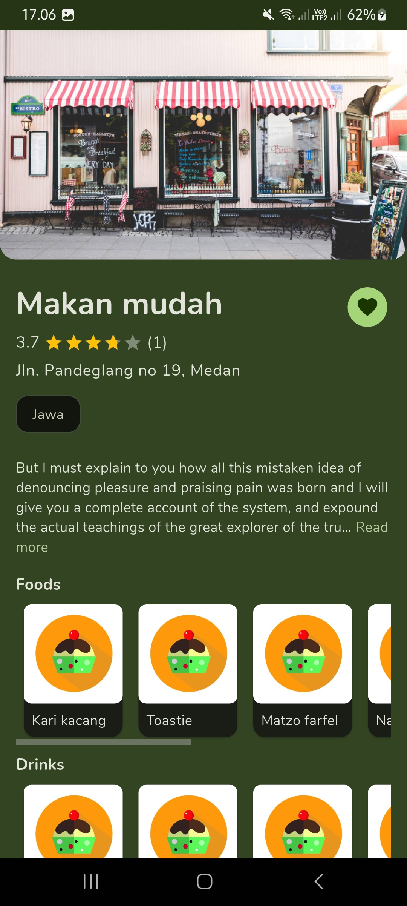&nbsp;
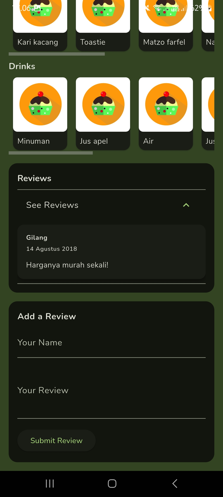&nbsp;
&nbsp;

## 🧪 Testing

This project includes unit tests, widget tests, and instrumented test to ensure the correctness of the application. We use GitHub Actions  to automatically run the tests on each pull request, and you can view the results [here](https://github.com/waffiqaziz/restaurantzz/actions/workflows/flutter-test.yml). To run testing on your local machine please read [here](/docs/TESTING.md).

## 🤝 Contributing

Feel free to contribute to this project by adding new features, improving the code, or enhancing the overall design.
Whether it's fixing a bug, refining the UI, or suggesting improvements, all contributions are welcome!
